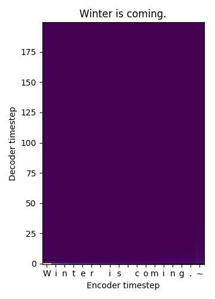

# [OOP 11조 6주차 주간보고서]
> 회의 날짜 : 19.11.10 17:00 ~ 21:00 #5번째 회의
> 참석자 : 황성민, 전상규, 장경호, 이태희
## Voice Swap
> 아직 한국어 dataset이 없어서, LJSpeech(영어)를 활용하여 train을 시켰다.
### CuDNN 설치 요청
* GPU를 사용하여 train을 시키기 위해서는 CuDNN library를 설치해야한다. 
* 이미 Cuda는 설치되어 있는 것을 확인햇다

### Train 시작
* GPU가 없는 상태이기에 일단 train은 CPU를 통해서 실시 하였다.
* 또한, 아직 data가 적기 때문에, single model 버전으로 train을 시켰다.
    * 역시 엄청 느리다. 대략 1000번의 epochs를 돌리고 난 후 결과는 다음과 같다.
    
    * spectrum이 만들어지지 않을 것을 볼 수 있다. issue에서 찾아보니, 적어도 110,000 epochs 정도를 train을 돌려야, 알아들을 수 있는 수준의 음성이 나온다고 한다
    * 일단 CPU를 통해서 train을 시키고, 요청한 CuDNN이 설치가 되면 그때서 부터 GPU를 활용하여 train을 시키겠다.

### 실행 방법
* single model
    *  우선, 음성파일에 대응하게 text을 json 파일로 만든다.
    * train시, 음성과  Text의 위치를 알 수 있게 *.npz파일로 변환을 한다
    `` python3 -m datasets.generate_data ./datasets/<folder name>``
    * 이제 train을 시작하자
    ``python3 train.py --data_path=datasets/<folder name> --load_path logs/<log name>``
    * 이제 하염없이 기다린다.....
    *  train을 어느 정도 실 시한 후, 다음 2가지 code를 실행시켜 output을 본다. (영어 Data기준)
      * ``python3 app.py --load_path logs/<log folder name> --num_speakers=1 --is_korean=False``
        * web에서 실시간으로 삽이하는 text에 대하여 train 목소리로 text를 읽는다.
      * ``python3 synthesizer.py --load_path logs/<log folder name>--text="Winter is coming." --is_korean=False``
        * "winder is coming"이라는 문장을 wav파일로 변환한다.

## FaceSwap
