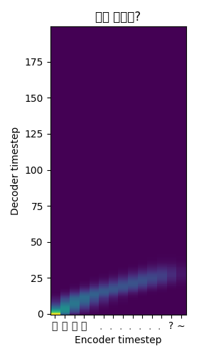

# [OOP 11조 13주차 주간보고서]

> 회의 날짜 : 19.12.1,  16:00 ~ 22:30  #회의 참석자 : 황성민, 전상규, 장경호, 이태희
>
> 최종방향성 : 손석희 뉴스(원하는 텍스트의 음성 출력 ) -> 야나두(강다니엘) + 트로피카나(아이유) 광고 영상 합성

## VoiceSwap

* 한국어 Dataset 수집 완료

  * 손석희 앵커의 앵커 브리핑에 대한 동영상 Data 50 GB와 kaggle에서 제공해준 4 GB의 kss 데이터를 확보했다.  kss 데이터는 text까지 제공을 해주었기 때문에 바로 학습을 시작하였고  손석희 앵커님의data는 영상에서 음성으로 그리고 음성에서  text로 바꾸는 작업을 현재 실행 중 입니다.

  * 음성에서 text로 바꾸는 작업은 Clova stt API를 활용하여 변환하고 있습니다.

  * 현재,  kss 데이터는 12,000회의 학습을 완료 했으며 avg loss는 대략 0.089 정도를 보여주고 있다. 아래 그림은 학습된 모델이 "이건 실회냐?" 라는 문장에 대한 plot graph이다

    

  * 아직은 뚜렷하게 "이,거,실,화,냐"라고는 들리지 않지만, 어렷풋한 음성과 5글자를 말하려는 발화자의 의지를 들을 수 있다.

## Face Swap

- 타켓 영상 데이터 확보
  - 아이유
    - 유튜브에서 4시간 가량
    - `~/OOP/LTH/faceswap/faces/IU`
  - 강다니엘
    - 유튜브에서 1시간 가량
    - `~/OOP/LTH/faceswap/faces/daniel`
- 원본 영상 데이터 확보
  - 야나두 영상
    - `~/OOP/LTH/faceswap/faces/JJS`
  - 트로피카나 4가지 버전(사과)
    - `~/OOP/LTH/faceswap/faces/Juyee`

##  차주목표

- 최종 보고서 준비 완료
  - https://docs.google.com/document/d/1W3s3ASgQ1E7tV6Pleh4Fpps1XkzpOX-iZ82iuM7mJVc/edit
- 최종 결과 영상 준비

